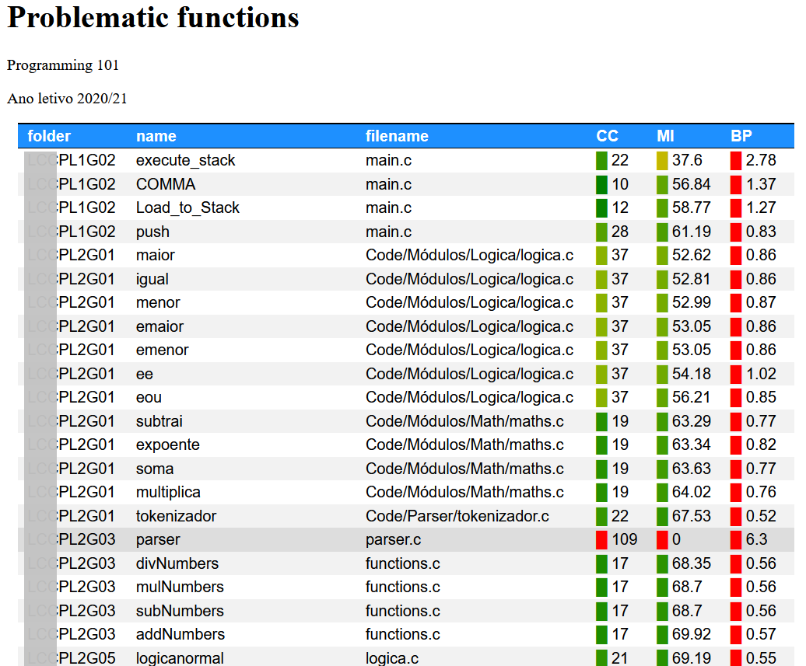

---
author:
- Rui Mendes
- José João Almeida
theme: Boadilla
title: A Teaching Assistant for the C Language
nocite: '@*'
biblio-title: References
---

[//]: # (
pandoc -t beamer -H latex_preamble.tex -s --bibliography assignments.bib --filter pandoc-citeproc moopec.md  -o moopec.pdf
)

# Motivation
- Pandemic
- Large classes
- Automatic evaluation
- Need to provide feedback

# Problem: If it *works*, it is correct!
## A working solution can be
- Poorly written
- Hard to read
- Difficult to maintain
- Poorly documented

# How to teach programming?
1. Imperative languages
1. Functional languages
1. Software engineering

# Bloom taxonomy
1. Remember
1. Understand
1. Apply
1. Analyse
1. Evaluate
1. Create

# A possible solution
- Automatic evaluation of computer programs
- Software metrics
- Documentation coverage

# Software metrics
- They help **analyse** and **evaluate** written code
- Complexity
	- Cyclomatic complexity
	- Halstead volume
	- Efective lines of code
- Maintainability
- Can be used to **understand** which are the poorly written functions

# Documentation
- Introduces discipline
- Writing documentation forces students to:
	- **Understand** what each function does
	- **Identify** the function of each argument
	- **Understand** what each function returns
	- **Evaluate** their code

# Problems with documentation
## Students often
- Forget to document arguments
- Confuse arguments with local variables
- Don't understand what is returned
- Forget to update documentation after changing functions
- Existing documentation coverage doesn't check these problems

# Query language

	SHOW <expressions  separated by spaces or semicolons>
	[HEADER <fields separated by spaces>]
	[COND <Python conditions using  fields>]
	[SORT <fields separated by spaces>]
	[COLOR <field> : <expression>[; <field> : <expression>]*]
	[
	GROUP_BY <fields separated by spaces>
	[AGGREG <expressions separated by spaces or semicolons>]
	]

# Example
\small
~~~{.cpp}
# List of problematic functions
These functions are too complex and should be rewritten:

```
SHOW project name cyclomatic_complexity maintainability_index
HEADER project name CC MI
COND CC > 10 or MI < 60
SORT project -MI CC name
COLOR
    CC : scale_lower(0,50)(CC);
    MI : scale_upper(0,100)(MI)
```
~~~
\normalsize

# Example

{ width=70% }


# Examples using aggregation
\small
~~~{.cpp}
SHOW name project return loc
GROUP_BY project return
AGGREG len(name) min(loc) mean(loc) max(loc)

SHOW name project return loc
GROUP_BY project
AGGREG mean(loc); (lambda L: len([x for x in L if x < 10]))(loc)
~~~
\normalsize

# Anatomy of a project, part II
- Mooshak for automatic project evaluation
- C teaching assistant for:
	- Flagging function complexity
	- Helping check documentation mistakes
	- Quantitative assessment

# Conclusions
- Helps create reports
- Helps students understand:
	- What part of the code should be rewritten
	- What functions are not correctly documented

# Availability

[https://github.com/rcm/C_teaching_assistant](https://github.com/rcm/C_teaching_assistant)
