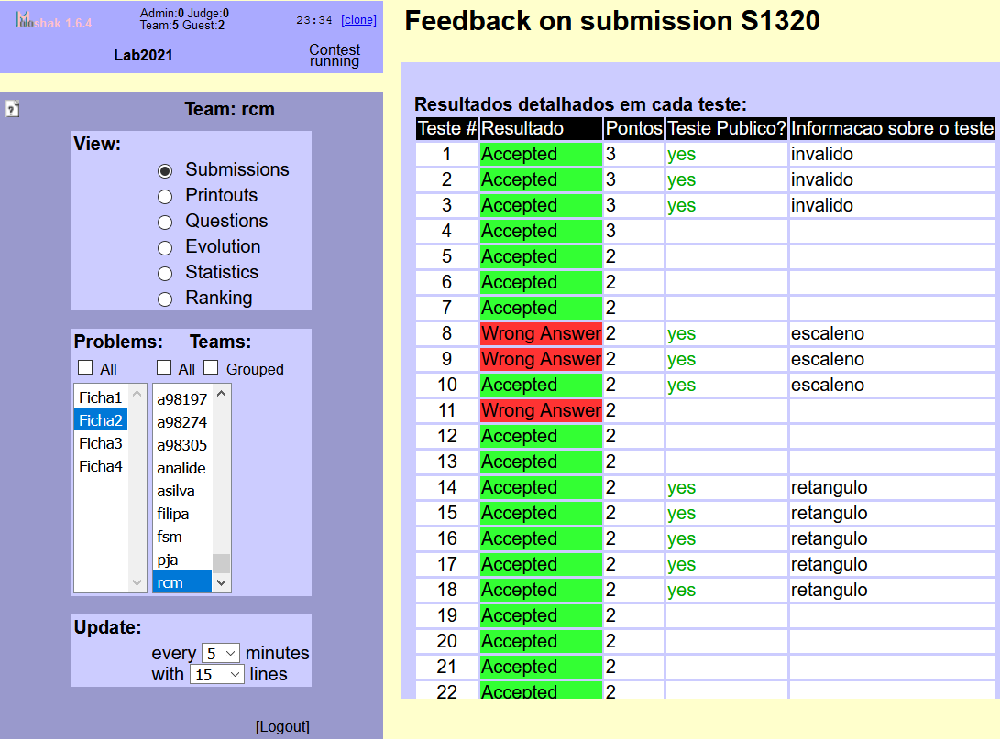
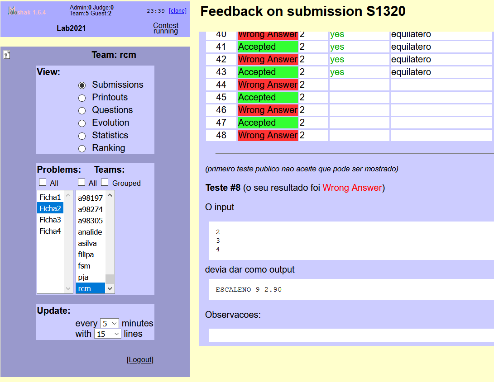
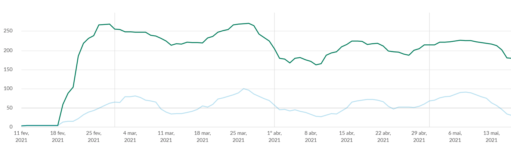
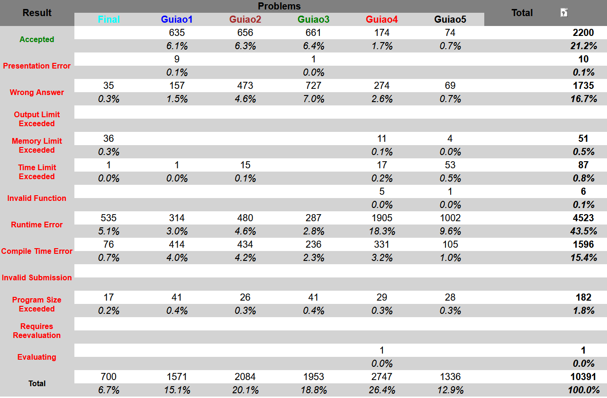
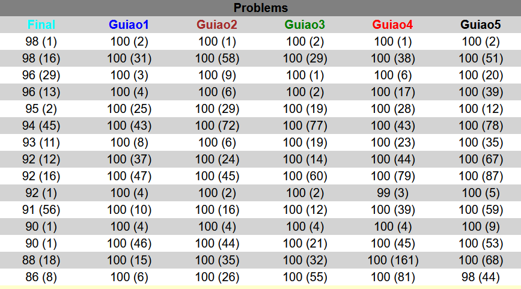

---
author:
- Rui Mendes
theme: Boadilla
title: Moopec
subtitle: A tool for creating programming problems
nocite: '@*'
biblio-title: References
---

[//]: # (
pandoc -t beamer -H latex_preamble.tex -s --bibliography assignments.bib --filter pandoc-citeproc moopec.md  -o moopec.pdf
)

# Motivation
- Pandemic
- Large classes
- Need to provide feedback
- Automatic evaluation
- Many solutions available online
- Need to create a large number of problems

# Interface
## Point & Click
- More intuitive
- Creating problems involves filling fields and pressing buttons
- Most fields are self explanatory
- Tests must be created elsewhere

## Batch
- Users need to learn a small language
- Problems are created in a textfile using a DSL
- Tests may be created elsewhere or generated programatically
- Can create many problems by editing a single text file

# Automatic evaluation systems
- Most opt for a Point & Click interface
- Intuitive
- Problems are created one at a time
- Creating several problems is **slow**

# Mooshak
- Developped by this session's chairman
- Used in ICPC and IOI contests
- Robust
- Used in classes in several Universities
- Allows both binary and partial evaluation
- File system based
- Contests and problems may be created by adding files

# Creating problems in Mooshak

- Name, letter and description
- Limits (e.g., CPU, memory)
- Each test
	- input and output
	- Arguments
	- Context
	- How many points?
	- Is it shown?
	- Feedback

# How to tackle different problem types?
- Compiler
- Static corrector
- Dynamic corrector

# Problem types

Problem
 : inputs and outputs

Basecode
 : Compiler or Static corrector

Algorithm
 : Time or space complexity

Buggy code
 : Compiler or Static corrector

# DSL
NAME
:   Problem name; problem ends with END

LETTER
:   Folder name

TESTS
:   One or more tests; ends with END

IMPORT
:   The name of a Python module to import

CODE
:   Python code, ends with END

SOLVER
:   Lambda or function name

DESCRIPTION
:   Uses markdown, ends with END

POINTS
:   Evenly distributed among all tests

# DSL --- Tests

INPUT
:   One line of input

LONGINPUT
:   One or more lines of input; ends with END

INPUTGEN
:   $n$ followed by lambda or function name

FEEDBACK
:   feedback message for these tests

POINTS
:   Points per test

SHOW
:   Are they shown?

# Example
	NAME     Summing a bunch of  numbers
	LETTER   A
	SOLVER	lambda s: sum(int(x) ** 2 for x in s.split())
	TESTS
		INPUT	10 20 30
		FEEDBACK	Example given in the problem description
		SHOW
	END
	DESCRIPTION
	# Sum a list of numbers
	Create a program that:
	-  reads several numbers and
	-  prints the sum of their squares
	END
	POINTS 100
	END

# Example
	NAME     Summing a bunch of  numbers
	LETTER   A
	IMPORT sum_problem
	SOLVER	solution
	TESTS
		INPUTGEN 10 pequeno
		FEEDBACK small tests
	END
	DESCRIPTION
	# Sum a list of numbers
	Create a program that:
	-  reads several numbers and
	-  prints the sum of their squares
	END
	POINTS 100
	END

# Example of feedback 

{ width=45% }
{ width=45% }

# Anatomy of a project
- Created using Moopec
- Implemented as a contest with 6 problems
- Each problem was worth 100 points
- Each problem had its own description and several examples
- 5 deliverables
	1. 50 tests
	1. 50 tests
	1. 52 tests
	1. 100 tests
	1. 40 tests
- All tests were shown
- Final tests: 40 blind tests

# Anatomy of a project: feedback
- Students could see the first test that failed
- They could ask for help solving the problems with their code in Slack
- Slack had 8435 messages
- Tutoring was also available during classes and by videoconference

# Anatomy of a project: feedback on Slack

{ width=95% }

# Anatomy of a project
{ width=95% }

# Anatomy of a project
{ width=95% }

# Conclusions
- Moopec allows the batch creation of exercises
- It allows the usage of Python for creating both tests' input and output
- It is possible to use arbitrary programs as well due to `system` and `subprocess`
- Problem descriptions can be created with markdown
- Author tested it by creating more than 50 problems

# Avaliability

[https://github.com/rcm/mooshak_problem_creator](https://github.com/rcm/mooshak_problem_creator)
